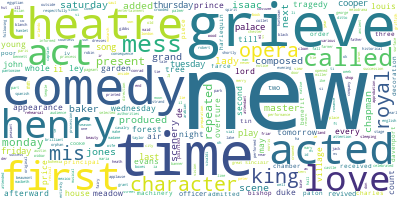

# notebook-texts-example
This project includes notebooks to work with datasets that contain text and metadata. 

## notebook-marc-csv-example
Example of notebook to extract a dataset as a CSV file from a digital collection described using marc xml files. [View notebook in nbviewer](https://nbviewer.jupyter.org/github/hibernator11/notebook-marc-csv-example/blob/master/Dataset-Extraction-Example.ipynb)

This notebook uses a dataset of descriptive metadata from the [Moving Image Archive catalogue](https://data.nls.uk/data/metadata-collections/moving-image-archive/), which is Scotland’s national collection of moving images.

## topic-modeling-billing
Example of notebook to extract the most common words in a corpus of text documents. This notebook is an example of Topic Modeling based on Digitised Volumes of theatrical English, Scottish, and Irish playbills between 1600 - 1902 from [data.bl.uk](data.bl.uk). [View notebook in nbviewer](https://nbviewer.jupyter.org/github/hibernator11/notebook-marc-csv-example/blob/master/topic-modeling-billing.ipynb)

# References
The [GLAM Workbench](https://glam-workbench.github.io/) has been used as inspiration to create this example. In particular, the notebook [Exploring metadata harvested from the Tribune negative collection in the State Library of NSW](https://nbviewer.jupyter.org/github/GLAM-Workbench/ozglam-data-records-of-resistance/blob/master/Exploring-Tribune-negatives-metadata.ipynb).

Theatrical playbills from Britain and Ireland (OCR text only)
Optically Character Recognised (OCR)-derived text for the playbills, encoded in UTF-8.
DOI: https://doi.org/10.21250/pb2
